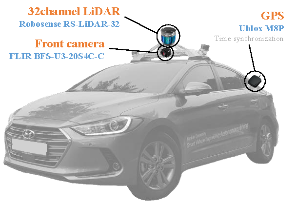
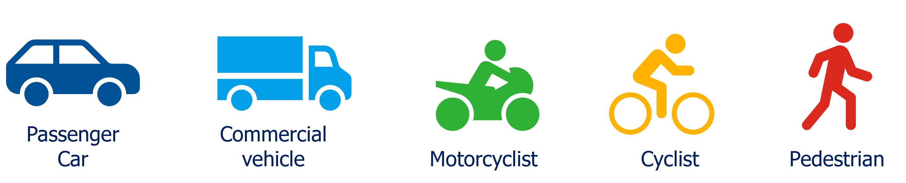
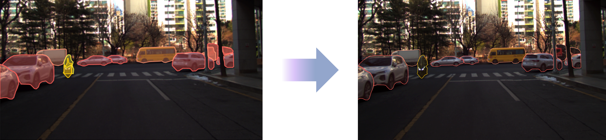
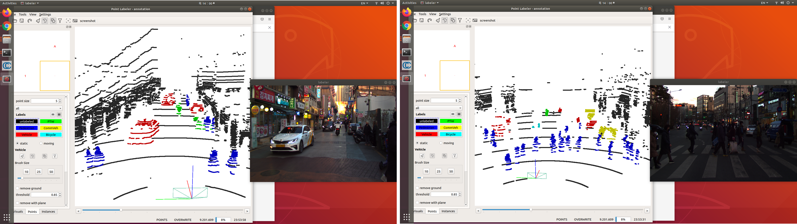

# SPISS dataset
The dataset for Paper "*Multi-Modal Dataset and Fusion Network for Simultaneous 2D and 3D Semantic Segmentation of On-road Dynamic Objects*"

This repository provides a description and access of SPISS(Simultaneous point cloud and image semantic segmentation) dataset.

The SPISS dataset is a comprehensive dataset for on-road dynamic objects, created through our advanced data collection platform. This dataset combines high-resolution image data from a two-megapixel camera and precise point cloud data from a 32-channel scanning LiDAR.

<div align="center">
<p float="center">


<br />
<b>Example clip from our dataset with ISS annotations (left), and PCSS annotations (right) overlaid.</b>
</p>
</div>

---

## Sensors
We recorded the output of the following sensors:

- a camera (1616 × 1240 px, ∼30 Hz) mounted on the roof, and
- a Robosense RS-32 LIDAR (∼10 Hz) scanner on the roof

See the figure below for a general overview of the sensor setup.

<div align="center">

<br />
<b>Data acquisition platform</b>
</div>
<br>

GPS was used for time synchronization between the two sensors. Camera and LIDAR external calibration was performed with reference to [MATLAB](https://www.mathworks.com/help/lidar/ug/lidar-and-camera-calibration.html) for spatial alignment of data. See the example clip below for the spatio-temporal alignment results. The code that projects the LiDAR point cloud over the camera image can be found in [EXAMPLES](scripts/).

<div align="center">
<p float="center">

<br />
<b>Result of spatio-temporal alignment</b>
</p>
</div>

## Data Acquisition
The data was collected from Seoul and Gyeonggi areas in South Korea. We classify the collection area into three categories.

- *Highway*: a public road, especially an important road that joins cities or towns together
- *Downtown*: in or to the central part of a city
- *Side road*: a narrow road with no clear boundary between the roadway and the sidewalk

See the figure below to check the data collection area.

<div align="center">
<p float="center">

<br />
<b>Data acquisition area</b>
</p>
</div>

Data was collected in different times of the day, as well as in diverse locations. We provides data for all time zones, including sunset/sunrise, daytime, and night. 

See the figure below for a sample of image data by location and time zone.

<div align="center">
<p float="center">

<br />
<b>Sample of data acquisition environments</b>
</p>
</div>


## Data Annotation
We provide image/point cloud labels for 5 dynamic objects.

- “*Passenger Car”* includes SUV, sedan, etc.
- “*Commercial vehicle*” includes truck, bus, van, etc.
- “*Motorcyclist*” includes motorcycles, scooters, kick scooters, etc.
- “*Cyclist*” includes both bicycle and cyclist.
- “*Pedestrian*" means a person on the road who is not riding a vehicle.

<div align="center">
<p float="center">

<br />
<b>Class definition for on-road dynamic objects</b>
</p>
</div>

To reduce manual labors as much as possible, pre-trained weights are used to generate pixel-wise predictions for 20% of the total data. Workers inspect and correct them, and the corrected results are used as training data to increase the accuracy of the prediction. This cycle is performed equally for the remaining 30% and 50% data.

See the figure below to compare the results predicted by the model with the results corrected by the workers.

<div align="center">
<p float="center">

<br />
<b>Image labeling</b>
</p>
</div>

To ensure consistency of labeling for the same scene, generated pixel-wise labels are transferred to the LiDAR domain. As shown in the figure below, workers use the [PointLabeler](https:/) tool to improve the quality of point cloud labels.

<div align="center">
<p float="center">

<br />
<b>Point cloud labeling</b>
</p>
</div>

## Data Organization
The data is organized in the following [SemanticKITTI](http://www.semantic-kitti.org/) format:

```
/dataset/
    └── sequences/
            ├── 00/
            │   ├── calib.txt
            │   ├── img/
            │   │     ├ 000000.png
            │   │     └ 000001.png
            │   ├── labels/
            │   │     ├ 000000.label
            │   │     └ 000001.label
            │   ├── seg/
            │   │     ├ 000000.png
            │   │     └ 000001.png
            │   └── velodyne/
            │         ├ 000000.bin
            │         └ 000001.bin
            ├── 02/
            ├── 03/
            .
            .
            .
            └── 16/
```

## Access
- [Sample](https://drive.google.com/drive/folders/1FJZ5WMp6SgNVKWpQkKGIlXk36CjBO9Q6?usp=sharing) (00 sequence)
- [Full](https://drive.google.com/file/d/1m4zR5J2TS-0YOvRNTLSBpk2OwuTzNTrJ/view?usp=sharing) (00-16 sequences)

## Contact
If you have any questions, please let me know:
- Jieun Cho (`chojieun97@gmail.com`)
- Jinsu Ha (`soo4826@gmail.com`)

## Citation